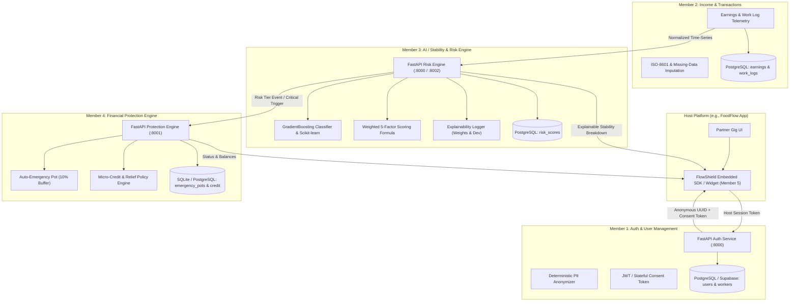

# 🛡️ FlowShield — Embedded Financial Resilience Engine

> **Empowering informal & gig economy workers to navigate unpredictable income through real-time earnings telemetry, explainable AI stability modeling, and automated financial safety nets.**

---

## 📌 Executive Summary

Informal and gig workers (delivery partners, rideshare drivers, freelance contractors) experience severe income volatility without traditional employee benefits, paid leaves, or financial safety buffers. A sudden dip in weekly income or unexpected vehicle repair can trigger debt spirals.

**FlowShield** is an embedded financial resilience microservice platform and SDK. It seamlessly integrates into host gig platforms (such as delivery or ridesharing apps) to:
1. **Track and Normalize Earnings Telemetry** in real time.
2. **Model Worker Financial Stability (0–100)** using transparent rule-based metrics and machine learning (Gradient Boosting) without ingesting any Personally Identifiable Information (PII).
3. **Automate Financial Protection & Smoothing** via an intelligent **Emergency Pot** (micro-allocating 10% from high earnings periods) and micro-credit pre-qualification.
4. **Deliver Proactive Insights** via a mobile-first dashboard and an embeddable partner SDK widget.

---

## 🏗️ System Architecture & Data Flow



---

## 👥 Hackathon Application Division (5-Member Team)

As defined in the project implementation plan, FlowShield is partitioned into five specialized modules with strict API contracts and privacy handoffs:

| Member | Focus Area | Primary Tech Stack | Core Responsibilities |
|---|---|---|---|
| **Member 1** | **Authentication & Identity** | FastAPI, JWT, Bcrypt, PostgreSQL | Secure session auth, RBAC, SDK partner tokens, **PII Anonymization**, **Stateful Consent Tokens** |
| **Member 2** | **Income & Transactions** | FastAPI, PostgreSQL, SQLAlchemy | Earnings capture, work logs, transaction history, **Time-Series Normalization**, **Imputation Readiness** |
| **Member 3** | **AI / Stability & Risk Engine** | FastAPI, Scikit-learn, Pandas, NumPy | FlowShield Stability Score (0–100), ML risk tiers, anomaly detection, **Explainability Logging**, **Bounded Contracts** |
| **Member 4** | **Financial Protection Engine** | FastAPI, SQLite/PostgreSQL | 10% Emergency Pot auto-contribution, micro-credit limits, **Decoupled Architecture**, **Graceful Degradation** |
| **Member 5** | **Frontend, Dashboards & SDK** | React 19, Vite, Tailwind CSS v4, Recharts, Capacitor | Mobile-first Worker Dashboard, Partner Dashboard, embedded SDK widget, **AI Transparency**, **Latency UX Mitigation** |

---

## 🔬 Deep-Dive: Module Breakdown & AI Handoff Guidelines

### 👤 Member 1: Authentication & User Management
- **Role**: Identity gateway for workers and platform partners.
- **Key Files**: `backend/auth/`, `backend/users/`, `backend/workers/`, `docs/privacy-contract.md`.
- **Core Endpoints**:
  - `POST /api/v1/auth/register` — Register worker with hashed credentials.
  - `POST /api/v1/auth/login` — Authenticate and issue JWT with role & AI consent claims.
  - `POST /api/v1/auth/sdk/token` — B2B token minting for partner platforms.
  - `POST /api/v1/mock-host/get-sdk-token` — Server-side token exchange for host apps.
  - `GET /api/v1/workers/{id}` — Worker profile with RBAC ownership validation.
- **AI Integration & Handoff Guidelines**:
  - **Data Anonymization Pipeline**: Generates and stores deterministic, anonymous UUIDs (`worker_id`). Strictly prevents names, emails, phones, or addresses from being forwarded to the AI Engine.
  - **Stateful Consent Tokens**: Embeds `ai_consent` and `consent_version` directly in the JWT payload, allowing downstream services to verify consent without repeated database queries.

---

### 💰 Member 2: Income & Transaction System
- **Role**: Continuous earnings ledger and transaction processor.
- **Key Files**: `backend/models.py` (`Earning`, `Transaction`), `FlowShield/member2_service.py`.
- **Core Endpoints**:
  - `POST /earnings` — Ingest daily/weekly payout records.
  - `GET /workers/{id}/earnings` — Fetch aggregated weekly and 7-day earnings.
- **AI Integration & Handoff Guidelines**:
  - **Time-Series Normalization**: Enforces strict ISO-8601 timestamps and unified currency baseline (INR / USD) to eliminate feature-skew in volatility computations.
  - **Imputation Readiness**: Explicitly flags sparse days (`is_missing_data: true`) so Member 3's pipeline can perform deterministic imputation (zero-fill for non-work vs. forward-fill).

---

### 🧠 Member 3: AI / Stability & Risk Engine
- **Role**: Real-time worker resilience scoring and anomaly detection.
- **Key Files**: `risk_engine/app/` (`predictor.py`, `scoring.py`, `train_model.py`, `feature_engineering.py`).
- **Scoring Logic**:
  1. **Rule-Based MVP Scoring Algorithm (0–100)**:
     $$\text{Stability Score} = 0.30 \times \text{Consistency} + 0.25 \times \text{Frequency} + 0.20 \times \text{Trend} + 0.15 \times \text{Savings} + 0.10 \times \text{External Risk}$$
  2. **Machine Learning Classifier**:
     - Trained `GradientBoostingClassifier` with standard scaler (`model.joblib`, `scaler.joblib`).
     - Evaluates volatility, variance, coefficient of variation, and earnings momentum to output class probabilities and calibrated stability scores.
  3. **Standardized Risk Tiers**:
     - 🟢 **Stable** (`70 – 100`)
     - 🟡 **At Risk** (`40 – 69`)
     - 🔴 **Critical** (`0 – 39`)
- **Core Endpoints**:
  - `POST /workers/{id}/calculate` — Compute, explain, and persist stability score.
  - `POST /workers/{id}/calculate-ml` — ML-based classification.
  - `GET /workers/{id}/stability-score` — Fetch current score and explainability breakdown.
  - `GET /workers/{id}/risk` — Low-latency status lookup for Member 4.
  - `GET /workers/{id}/history` — Historical risk trajectory.
- **AI Integration & Handoff Guidelines**:
  - **Explainability Logging**: Logs mean, standard deviation, individual feature weights, and triggered anomaly flags (`HIGH_INCOME_VOLATILITY`, `SHARP_INCOME_DECLINE`, `DEPLETED_SAVINGS_BUFFER`).
  - **Bounded API Contracts**: Strict Pydantic validators guaranteeing score in `[0.0, 100.0]` and tier in `{"Stable", "At Risk", "Critical"}`.

---

### 🛡️ Member 4: Financial Protection Engine
- **Role**: Automated policy execution, emergency safety fund, and credit smoothing.
- **Key Files**: `FlowShield/main.py`, `FlowShield/protection_logic.py`, `FlowShield/models.py`.
- **Core Endpoints**:
  - `POST /emergency-pot/contribute` — Add percentage of earnings to reserve.
  - `POST /emergency-pot/{worker_id}/auto-contribute` — Automatic 10% deduction from 7-day earnings.
  - `GET /emergency-pot/{worker_id}` — View balance, total contributed, and total used.
  - `GET /credit/{worker_id}/eligibility` — Pre-qualifies micro-credit:
    - **Stable**: ₹5,000 credit limit.
    - **At Risk**: ₹2,500 limited emergency buffer.
    - **Critical**: ₹0 credit, redirects to emergency pot release.
  - `POST /emergency-pot/{worker_id}/release` — Releases emergency funds when worker enters Critical status.
  - `GET /notifications/{worker_id}` — Historical financial safety actions.
- **AI Integration & Handoff Guidelines**:
  - **Decoupled Logic Architecture**: Treats Member 3's risk evaluations strictly as read-only event signals.
  - **Graceful Degradation**: If the AI engine is unreachable, default conservative safety rules engage automatically without failing worker transactions.

---

### 📱 Member 5: Frontend, Dashboards & SDK
- **Role**: Intuitive mobile-first worker interface and drop-in platform widget.
- **Key Files**: `frontend/src/` (`worker-dashboard/`, `sdk-widget/FlowShieldWidget.jsx`, `App.jsx`).
- **Core Features**:
  - **Mobile-First Worker Dashboard**:
    - **Stability Card**: Visual progress gauge showing stability score (0–100) and risk tier badge.
    - **Income Summary & Recharts Chart**: Weekly trends, daily breakdowns, and volatility indicators.
    - **Emergency Fund Tracker**: Visual target progress bar with interactive "Save ₹100" micro-savings action.
    - **Proactive Recommendations**: AI-driven tips on peak earning hours and buffer preservation.
  - **Embedded FlowShield SDK Widget**: Floating button (`FlowShieldWidget.jsx`) that opens a responsive bottom-sheet/modal within host gig apps (demonstrated inside the "FoodFlow" delivery app).
  - **Cross-Platform Android App**: Pre-configured Capacitor integration (`frontend/android`).
- **AI Integration & Handoff Guidelines**:
  - **Latency UX Mitigation**: Skeleton loaders for risk scoring and predictive telemetry widgets.
  - **AI Transparency**: Clear "AI-Generated" / "Model-Driven" badges and explainability tooltips detailing the underlying scoring factors.

---

## 📂 Repository Structure

```
FlowShield/
├── backend/                         # Member 1 & Shared Core Backend
│   ├── alembic/                     # Database migration scripts
│   ├── auth/                        # JWT authentication, security, and router
│   │   ├── dependencies.py          # Worker/Partner role verification
│   │   ├── router.py                # Register, login, SDK token endpoints
│   │   └── security.py              # Password hashing & JWT minting
│   ├── users/                       # User profile management
│   ├── workers/                     # Worker profile and history routes
│   ├── dashboard_router.py          # Aggregated dashboard endpoints
│   ├── database.py                  # SQLAlchemy engine & session factory
│   ├── models.py                    # Users, Workers, Earnings, Transactions
│   ├── schemas.py                   # Pydantic schemas & SDK token request
│   └── requirements.txt             # Backend dependencies
│
├── FlowShield/                      # Member 4: Financial Protection Engine
│   ├── database.py                  # Protection engine database session
│   ├── models.py                    # EmergencyPot, CreditAssessment, Notification
│   ├── protection_logic.py          # Eligibility, contribution, and release logic
│   ├── member2_service.py           # HTTP client to Member 2 Earnings API
│   ├── member3_service.py           # HTTP client to Member 3 Risk Engine
│   ├── main.py                      # Protection engine FastAPI application
│   ├── test_emergency_support.py    # Protection logic tests
│   ├── test_member2.py              # Member 2 integration test
│   └── test_member3.py              # Member 3 integration test
│
├── risk_engine/                     # Member 3: AI / Stability & Risk Engine
│   ├── app/
│   │   ├── api/routes.py            # Stability scoring & history routes
│   │   ├── ml/                      # ML training, feature pipeline & models
│   │   │   ├── feature_engineering.py
│   │   │   ├── train_model.py
│   │   │   ├── predictor.py
│   │   │   ├── model.joblib         # Serialized GradientBoosting model
│   │   │   └── scaler.joblib        # Serialized standard scaler
│   │   ├── models/risk_score.py     # SQLAlchemy model for risk_scores
│   │   ├── schemas/risk_score.py    # Strict Pydantic contracts & enums
│   │   ├── services/
│   │   │   ├── scoring.py           # Formula + ML composite evaluators
│   │   │   ├── metrics.py           # Volatility and trend calculation
│   │   │   └── cyclical_simulation.py
│   │   ├── database.py              # PostgreSQL / SQLite connection
│   │   └── main.py                  # Risk engine FastAPI application
│   ├── tests/                       # Pytest test suite (Phase 1-5 tests)
│   ├── demo.py                      # Interactive engine demo script
│   ├── supabase_schema.sql          # Supabase SQL DDL for risk_scores
│   └── requirements.txt             # Risk engine dependencies
│
├── frontend/                        # Member 5: React + Vite + Capacitor
│   ├── src/
│   │   ├── api/workerApi.js         # API client with fallback to mock data
│   │   ├── components/              # Host app components (FoodFlow)
│   │   ├── pages/                   # Home, Search, Profile views
│   │   ├── sdk-widget/
│   │   │   └── FlowShieldWidget.jsx # Embeddable Floating SDK Widget
│   │   ├── worker-dashboard/
│   │   │   ├── components/          # Stability, Income, Emergency, Recommendations
│   │   │   ├── workerData.js        # Realistic mock telemetry fallback
│   │   │   └── WorkerDashboard.jsx  # Main mobile-first dashboard view
│   │   ├── App.jsx                  # Host platform container & navigation
│   │   └── index.css                # Tailwind CSS styling
│   ├── android/                     # Capacitor Android studio project
│   ├── capacitor.config.json        # Capacitor configuration
│   └── package.json                 # Frontend dependencies (React 19, Tailwind v4)
│
├── docs/                            # Architecture & Security Documentation
│   ├── auth-api.md                  # Detailed authentication specification
│   ├── auth-flow.md                 # Visual sequence diagrams for auth
│   └── privacy-contract.md          # Anonymization & AI consent contract
│
└── test_api.py                      # End-to-end integration test runner
```

---

## 🚀 Getting Started & Local Setup

### Prerequisites
- **Python 3.10+**
- **Node.js 18+** & **npm**
- *(Optional)* PostgreSQL / Supabase account (services default to SQLite if `DATABASE_URL` is omitted).

---

### 1. Setup Backend Services

#### A. Auth & Core Backend (Member 1 & 2)
```powershell
cd backend
python -m venv .venv
.\.venv\Scripts\Activate.ps1
pip install -r requirements.txt
python -m uvicorn main:app --reload --port 8000
```
- Interactive Swagger UI: `http://localhost:8000/docs`
- Health Check: `http://localhost:8000/api/v1/health`

#### B. AI / Stability & Risk Engine (Member 3)
```powershell
cd risk_engine
python -m venv .venv
.\.venv\Scripts\Activate.ps1
pip install -r requirements.txt
python -m uvicorn app.main:app --reload --port 8002
```
- Interactive Swagger UI: `http://localhost:8002/docs`

#### C. Financial Protection Engine (Member 4)
```powershell
cd FlowShield
python -m venv .venv
.\.venv\Scripts\Activate.ps1
pip install -r ..\backend\requirements.txt
python -m uvicorn main:app --reload --port 8001
```
- Interactive Swagger UI: `http://localhost:8001/docs`

---

### 2. Setup & Run Frontend (Member 5)

```powershell
cd frontend
npm install
npm run dev
```
- Open your browser at `http://localhost:5173`.
- Experience the **FoodFlow** mock host delivery app with the integrated **FlowShield Safety** dashboard and floating widget.

---

## 🧪 Automated Testing & Verification

### Run End-to-End API Integration Suite
```powershell
python test_api.py
```
This tests:
1. Worker registration (`POST /api/v1/auth/register`)
2. Duplicate registration prevention (HTTP 409)
3. Worker login and JWT issuance (`POST /api/v1/auth/login`)
4. Authenticated profile lookup (`GET /api/v1/me`)
5. RBAC profile isolation (`GET /api/v1/workers/{id}`)
6. B2B SDK Token issuance (`POST /api/v1/auth/sdk/token`)

### Run Risk Engine Unit & Contract Tests
```powershell
cd risk_engine
pytest tests/ -v
```

---

## 🔒 Security & Privacy Guarantees

1. **Zero-PII Handoff to AI**: Member 3's AI pipeline operates purely on anonymous UUIDs, earnings floats, and timestamp intervals. No names, phone numbers, or emails are ever transmitted.
2. **Stateful Consent Verification**: AI modeling respects the `ai_consent` flag inside the cryptographically signed JWT. Revoking consent immediately halts downstream inferences.
3. **Graceful Degradation**: If microservices experience network partitions, Member 4's Financial Protection Engine falls back to conservative, deterministic rules to safeguard worker funds without delay.
4. **Strict Boundary Contracts**: Stability scores are enforced to `[0.0, 100.0]` floats and risk tiers strictly match standard Enums (`Stable`, `At Risk`, `Critical`).

---

## 🌟 Hackathon Presentation Highlights

- **Embedded B2B Architecture**: Rather than demanding workers download yet another standalone app, FlowShield embeds directly into existing gig economy platforms via an SDK widget.
- **Explainable AI**: Eliminates the "black box" algorithm problem by surfacing exact feature weights and clear plain-language rationale for every stability tier.
- **Automated Income Smoothing**: Solves the core volatility dilemma through automated micro-contributions and instant emergency liquidity during critical downturns.
